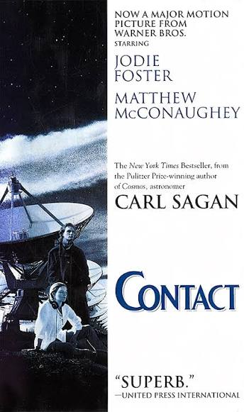
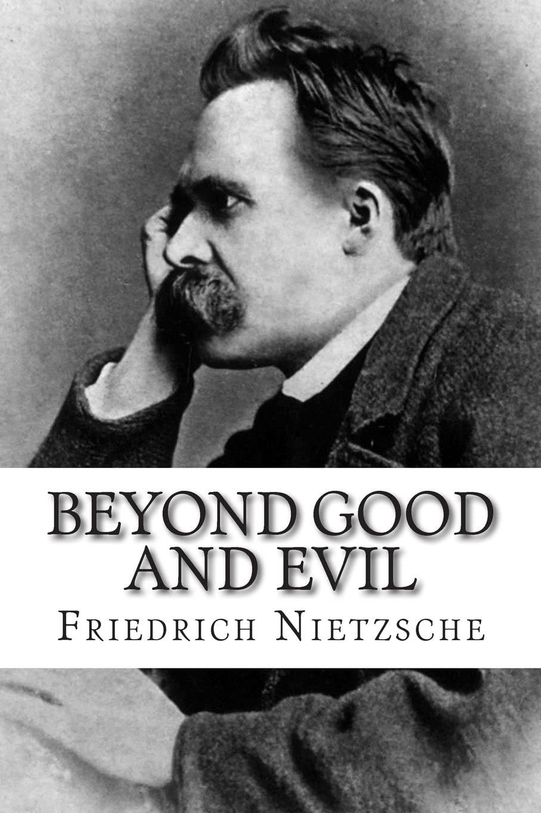
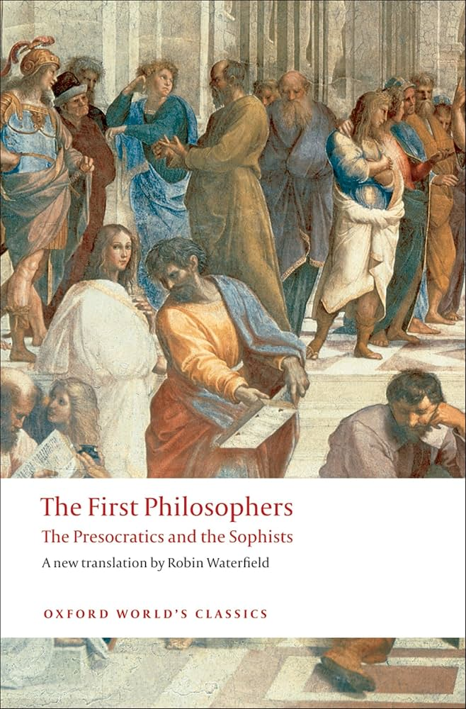
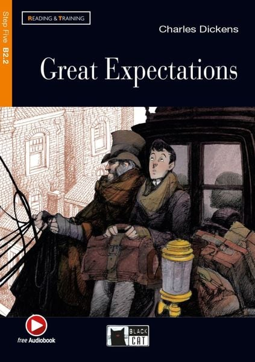
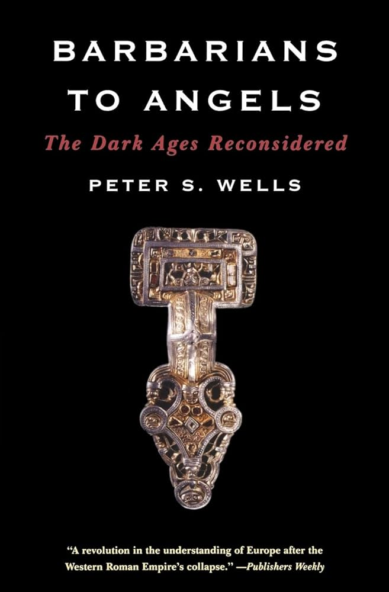

My reading ranges across literature, history, and philosophy. Here are the books I'm currently reading and those I've already read.

## Currently reading

:::: {.book-entry}
{fig-alt="Cover of Contact by Carl Sagan"}

::: {}
### Contact

Carl Sagan

*Science fiction*
:::
::::

:::: {.book-entry}
{fig-alt="Cover of Beyond Good and Evil by Friedrich Nietzsche"}

::: {}
### Beyond Good and Evil

Friedrich Nietzsche

*Philosophy*
:::
::::

:::: {.book-entry}
{fig-alt="Cover of The First Philosophers: The Presocratics and the Sophists, translated by Robin Waterfield"}

::: {}
### The First Philosophers: The Presocratics and the Sophists

Translated by Robin Waterfield

*Philosophy*
:::
::::

## Already read

:::: {.book-entry}
{fig-alt="Cover of Great Expectations"}

::: {}
### Great Expectations

Charles Dickens

*Literature*
:::
::::

:::: {.book-entry}
{fig-alt="Cover of Barbarians to Angels"}

::: {}
### Barbarians to Angels

Peter S. Wells

*History*
:::
::::

For shorter reading, see my [selected articles](../articles/index.qmd).
