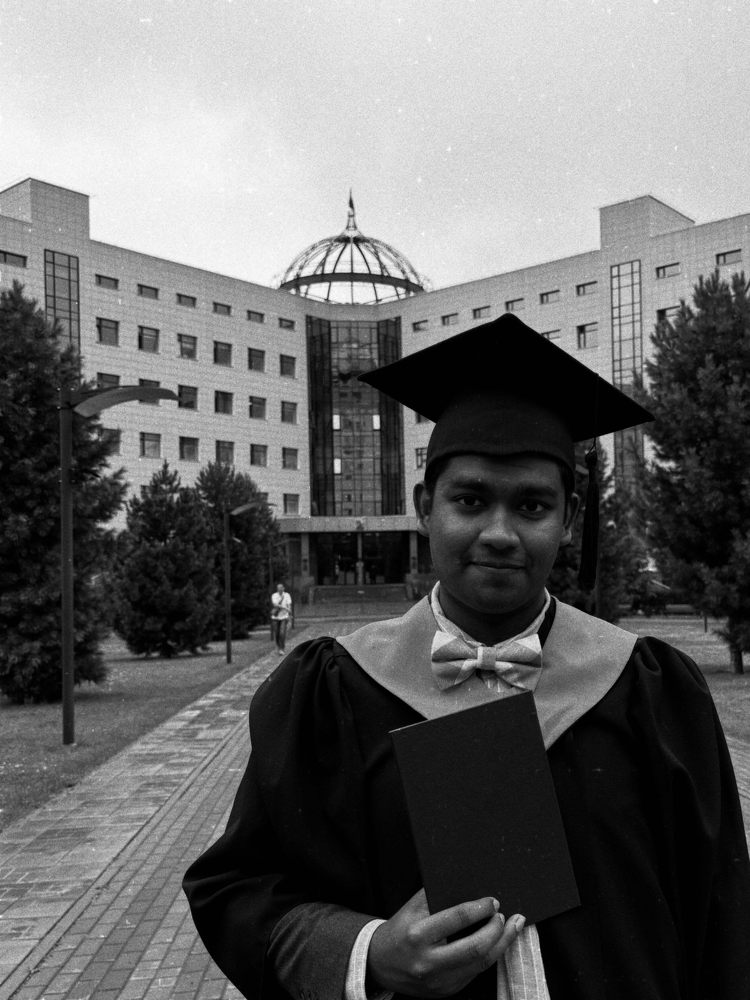

<!-- ===== Left section: photo + social links ===== -->

{.img-fluid
style="width:180px; height:180px; object-fit:cover; border-radius:50%; display:block; margin:auto;"}

### Rofikul Masud

Rheinische Friedrich-Wilhelms-Universität Bonn  
MSc. in Computer Science — Class of 2028

*Alma Mater*  
Novosibirsk State University  
BSc. in Computer Science — Class of 2025  

<!-- Social links -->
<ul class="social-links-grid">
  <li><a href="https://t.me/ovid_d" target="_blank"><i class="bi bi-telegram"></i> Telegram</a></li>
  <li><a href="https://www.linkedin.com/in/rofikul-masud-a984a3267/" target="_blank"><i class="bi bi-linkedin"></i> LinkedIn</a></li>
  <li><a href="https://orcid.org/0009-0009-1917-8320" target="_blank"><i class="bi bi-person-badge-fill"></i> ORCID</a></li>
</ul>

<!-- ===== Right section: about + books ===== -->

### About me
You can call me Rafik.  
I'm a first year MSc Computer Science student at Uni Bonn. I won't say too much about me, but I have a wide range of interests and a great passion for learning and exploring. As they say, there's always more to discover and I trully believe it. 

Aaa when I'm not studying, you'll find me diving into contemporary history, philosophy, literature, and music anywhere from classical to indie rock to folk. Also, I write blogs occationally, specially about travels, books and ect, whatever interests me.

I'm Fluent in Russian and English, and slowly figuring out German. So, feel free to reach out anytime.
 

### What I'm reading now?

  
<strong>Great Expectations</strong> — Charles Dickens

  
<strong>Barbarians to Angels</strong> — Peter S. Wells

 <!-- home-right -->

 <!-- home-container -->
