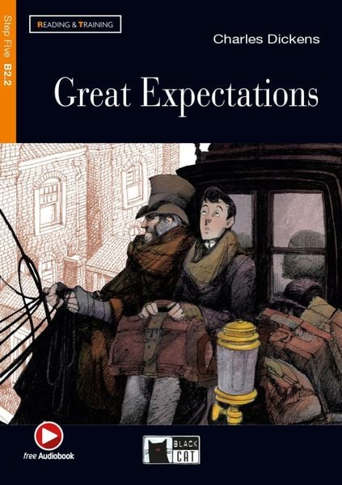
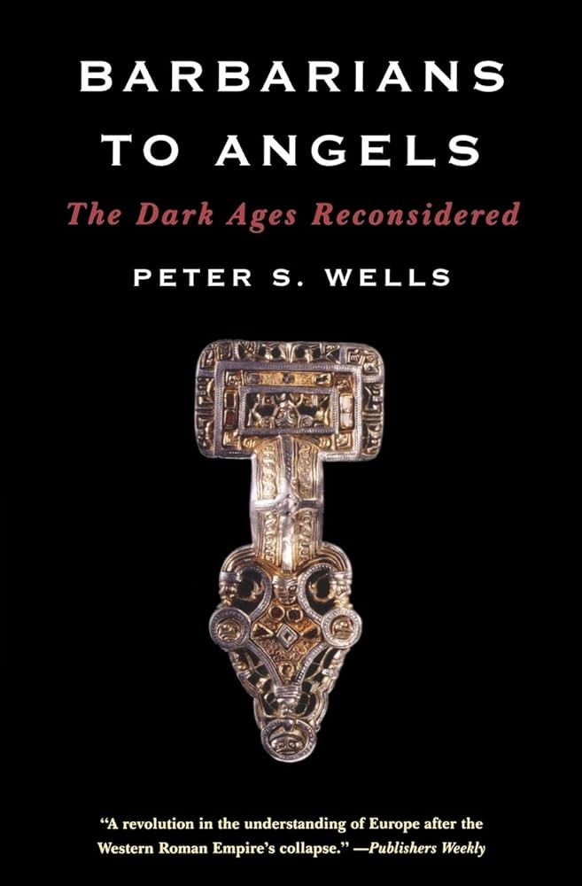

<!-- ===== Left section: photo + social links ===== -->

{.img-fluid 
style="max-width:260px; height:auto; object-fit:cover; border-radius:12px; display:block; margin:auto;"}

### Rofikul Masud

Rheinische Friedrich-Wilhelms-Universität Bonn  
MSc. in Computer Science — Class of 2028

*Alma Mater*  
Novosibirsk State University  
BSc. in Computer Science — Class of 2025  

<!-- Social links -->
<ul class="social-links-grid">
  <li><a href="https://t.me/ovid_d" target="_blank"><i class="bi bi-telegram"></i> Telegram</a></li>
  <li><a href="https://www.linkedin.com/in/rofikul-masud-a984a3267/" target="_blank"><i class="bi bi-linkedin"></i> LinkedIn</a></li>
  <li><a href="https://orcid.org/0009-0009-1917-8320" target="_blank"><i class="bi bi-person-badge-fill"></i> ORCID</a></li>
</ul>

<!-- ===== Right section: about + books ===== -->

### About me
You can call me Rafik.  
CS Master's student at the University of Bonn, working toward a PhD somewhere down the line.My interests live at a weird and wonderful crossroads between Computational Astrophysics, Geoinformatics, and Digital Humanities. In short, I like using computers to ask big questions, whether that's about the cosmos, the planet, or the humans living on it.  
When I'm not studying, you'll find me diving into contemporary history, philosophy, literature, or music anywhere from classical to indie rock to folk. I write the occasional blog, love to watch documentaries, and enjoy a good debate.
Fluent in Russian and English, slowly figuring out German.

Well, feel free to reach out anytime. 

### What I'm doing now?

::: {.book-cards}

  
  <h5>Great Expectations</h5>
  
Charles Dickens

  Ongoing

  
  <h5>Barbarians to Angels: The Dark Ages Reconsidered</h5>
  
Peter S. Wells

  Ongoing

:::

 <!-- home-right -->

 <!-- home-container -->
